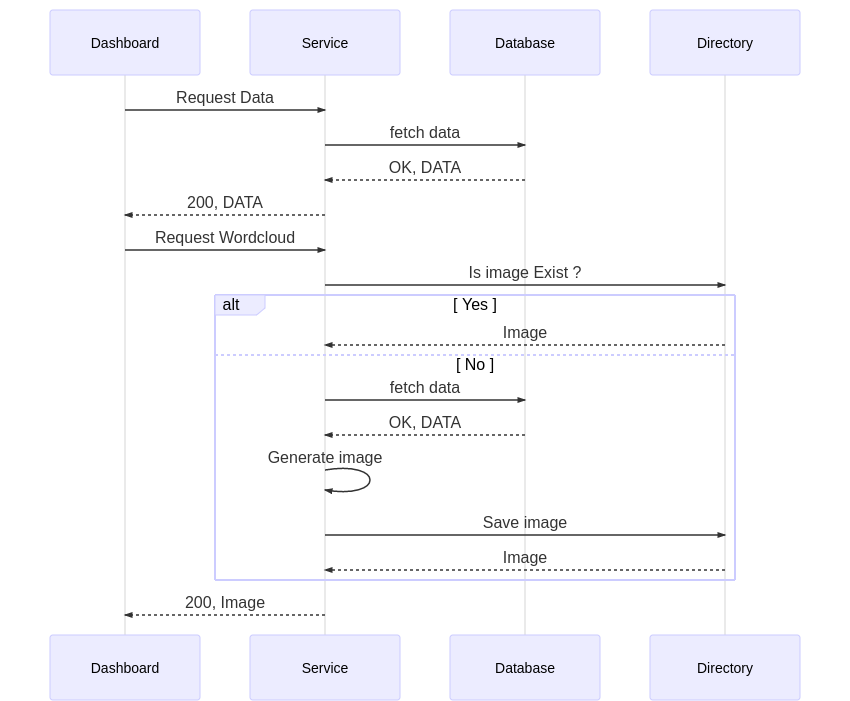
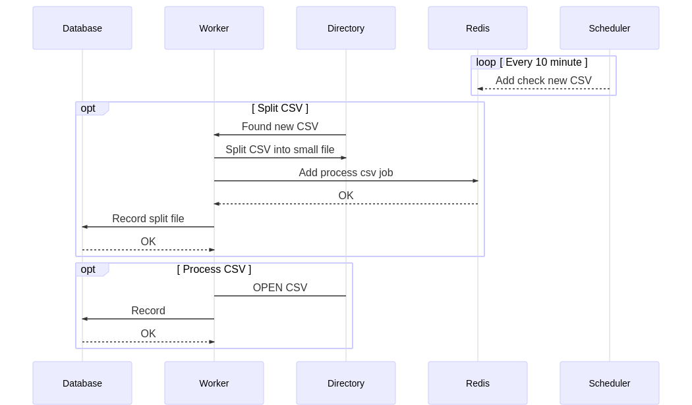

# social-d

Social processing, Require `docker` , `docker-compose v3`, `Makefile` to run if you don't have Makefile you can copy directly from Makefie

Accept csv format with column
```
id,type,message,time,engagement,channel,owner id,owner name
```

## Table of content

- [Setup & How to use](##Setup)
- [Running test](##test)
- [API](##API-and-Dashboard)
- [Example Dashboard](jupyter/dashboard.ipynb)
- [Dashboard](###Dashboard)
- [System design](##System-design)
- [Improvement](##Improvement)

## Setup

- Clone this repo
- Place you csv at [src/raw_data](src/raw_data)
- This command will format project and start from fresh again
```
make format
```
- if you can't pull docker image build it with cmd: `docker-compose build`
- PS. I mount database volume to previous directory, if you do this at home it can have permission problem (and please delete volume yourself)

- To start service again
```
make start
```

- To stop
```
make stop
```

## Test
Unit test with pytest
```
make tests
```

## API and Dashboard

You can see all example request and response in [Example Dashboard](jupyter/dashboard.ipynb)

All the link can access if you already run service and have data

### Poke
If you place new csv in raw_data folder and want to process right away you can send request to this
- GET : `http://localhost:1111/poke`
```json
http://localhost:1111/poke
Response:
{
    "task": "341fc59f-ffbc-4dc3-a754-33a11ebe01de"
}
```

### Daily message
- GET: `http://localhost:1111/date/{from}/{to}/message/daily`
```json
http://localhost:1111/date/2019-01-01/2019-01-04/message/daily
RESPONSE
{
    "2019-01-01": 12929,
    "2019-01-02": 5690,
    "2019-01-03": 9711,
    "2019-01-04": 25387
}
```

### Account with top message

Get account with most total engagement in date range

- GET : `http://localhost:1111/date/{from}/{to}/message/top?q={query}`

```json
http://localhost:1111/date/2019-03-01/2019-04-02/message/top?q=samsung AND s10 OR @Chuuchu69
response
{
    "owner_id": "859096433034645504",
    "owner_name": "ตุ้มติ้ม",
    "total_engagement": 19300,
    "id_list": [
        "http://localhost:1111/message/1084133482354200576",
        "http://localhost:1111/message/1084133042958983170",
        "http://localhost:1111/message/1084133412728758272"
    ]
},
{
    "owner_id": "8678704302",
    "owner_name": "📲 สต็อกแน่น พร้อมส่ง",
    "total_engagement": 15425,
    "id_list": [
        "http://localhost:1111/message/amso.case_BvhPSKhDiQt",
        "http://localhost:1111/message/amso.case_BvhPQmeDtc7"
    ]
}
```

### Top message by engagement

- GET: `http://localhost:1111/date/{from}/{to}/message/engagement`
```json
http://localhost:1111/date/2019-01-01/2019-02-02/message/engagement
RESPONSE
{
    "engagement": 10000,
    "time": "2019-01-07 00:03:27+00",
    "message": "เป็นแบบนี้ดีแล้วคะ หนุกหนาน ไม่ต้องไปเคลียดมัน ชอบๆคะ555 ❤️👍"
},
{
    "engagement": 10000,
    "time": "2019-01-09 00:10:05+00",
    "message": "โหดด ก็มาดิคับน้องงงง"
}
```
### Wordcloud
- GET : `http://localhost:1111/date/{from}/{to}/message/wordcloud`
- http://localhost:1111/date/2019-01-01/2019-01-02/message/wordcloud


### hashtag cloud
- GET : `http://localhost:1111/date/{from}/{to}/message/hashtag`
- http://localhost:1111/date/2019-01-01/2019-01-02/message/hashtag


### Dashboard

- I write it in [jupyter nb](jupyter/dashboard.ipynb) (If you don't count this as dashboard please let me known)
- For access jupyter note book for fisttime you need to ken get it from type `docker logs social-d-jupyter` you'll see message like this

```
[C 17:50:20.968 NotebookApp] 
    To access the notebook, open this file in a browser:
        file:///home/jovyan/.local/share/jupyter/runtime/nbserver-6-open.html
    Or copy and paste one of these URLs:
        http://fb039ebbf9dc:8888/?token=85c5fa5f6e36185025ba002c6a9161c4b65856deefb3d901
     or http://127.0.0.1:8888/?token=85c5fa5f6e36185025ba002c6a9161c4b65856deefb3d901
```

- I suggest to access with url start with `http://127.0.0.1:8888`

## System design

This project have 5 container following this list

- `social-d-db` Postgres DB for record processed data
- `social-d-redis` Redis for queue job
- `social-d-scheduler` This worker will check csv in raw_data folder every 10 minute
- `social-d-service` aiohttp main service
- `social-d-worker` worker for split csv and process data
- `social-d-jupyter` as a Dashboard

### Request FLOW
<details>
    <summary> mermaid </summary>

    ```mermaid
    sequenceDiagram
        participant D As Dashboard
        participant S As Service
        participant DB As Database
        participant Dir As Directory


        D->>S: Request Data
        S->>DB: fetch data
        DB-->>S: OK, DATA
        S-->>D: 200, DATA

        D->>S: Request Wordcloud
        S->>Dir: Is image Exist ?
        alt Yes
        Dir-->>S: Image
        else No
        S->>DB: fetch data
        DB-->>S: OK, DATA
        S->>S: Generate image
        S->>Dir:Save image
        Dir-->>S: Image
        end
        S-->>D: 200, Image
    ```
</details>



### CSV FLOW

<details>
    <summary> mermaid </summary>
    ```mermaid
    sequenceDiagram
        participant DB As Database
        participant W As Worker
        participant D As Directory
        participant R As Redis
        participant Sc As Scheduler
        
        loop Every 10 minute
        Sc-->>R: Add check new CSV
        end

        opt Split CSV
        D->>W: Found new CSV
        W->>D: Split CSV into small file
        W->>R: Add process csv job
        R-->>W: OK
        W->>DB: Record split file
        DB-->>W: OK
        end

        opt Process CSV
        W->D: OPEN CSV
        W->>DB: Record
        DB-->>W:OK
        end
    ```
</details>



## Improvement

I plan to keep word and hashtag count into dictionary and keep it as day by day. but just realize I can do wordcloud without using that.

And I can do reverse index to keep improve at search time.